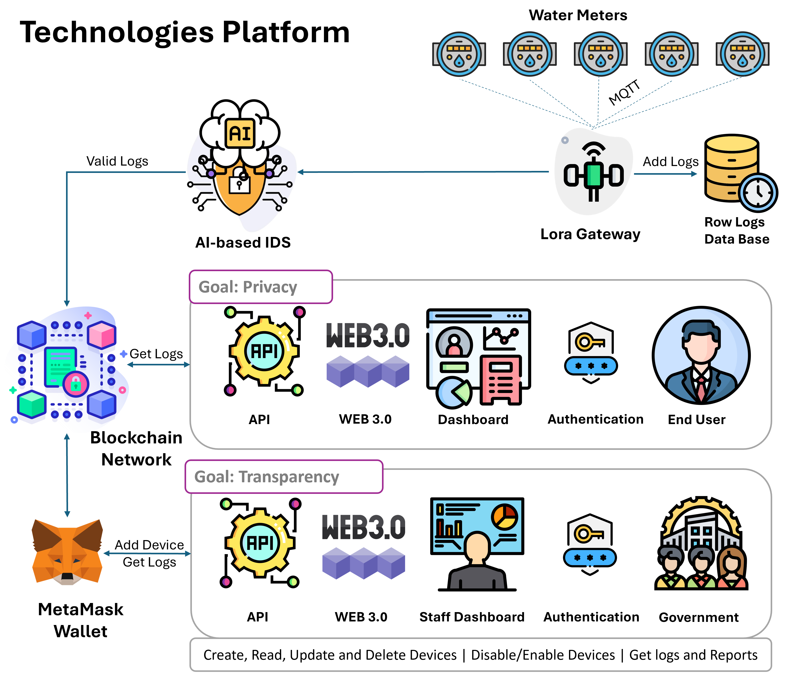
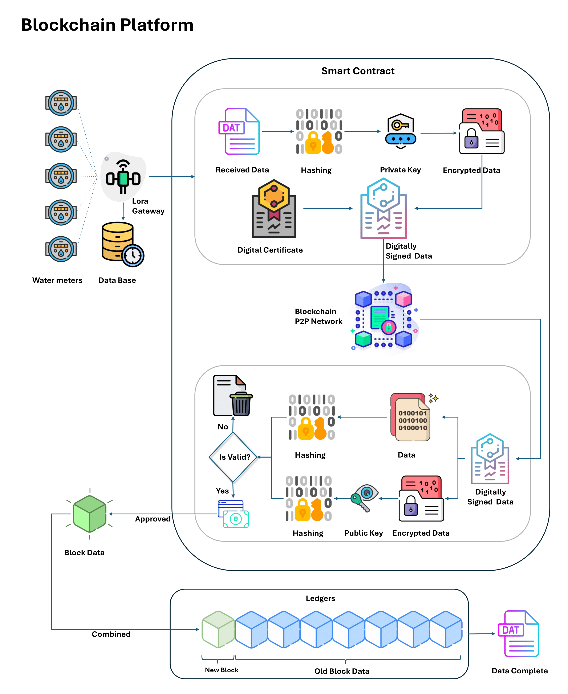
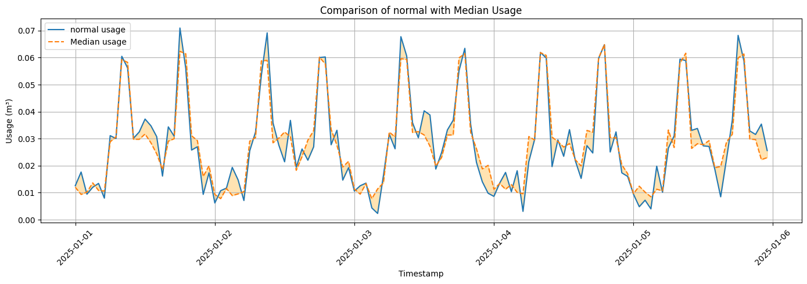
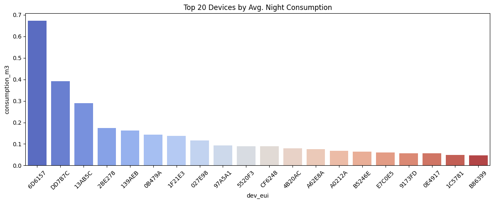
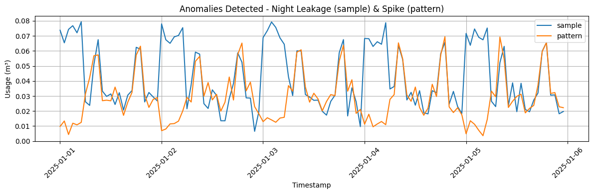
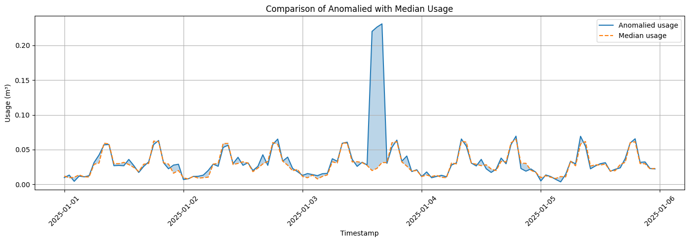
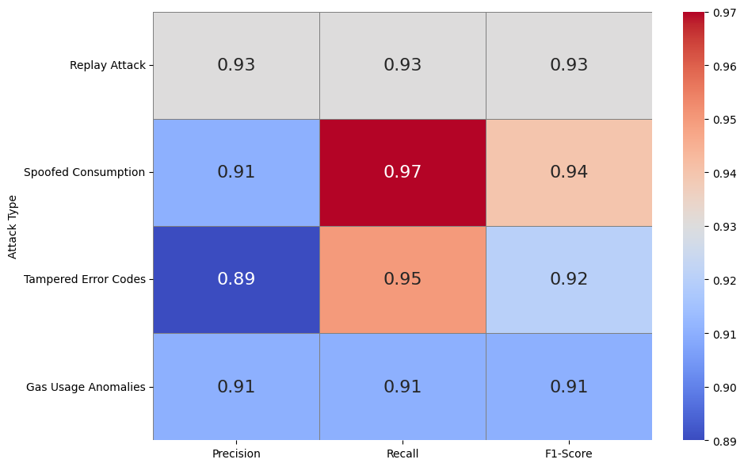

# Smart Water Security with AI and Blockchain-Enhanced Digital Twins

This repository contains the implementation of a secure, intelligent digital twin (DT) platform for rural water distribution networks. The system integrates **LoRaWAN-based data acquisition**, an **AI-powered Intrusion Detection System (IDS)** using **LSTM Autoencoder and Isolation Forest**, and a **private Ethereum blockchain** with **Proof of Authority (PoA)** to ensure tamper-proof and transparent water management.

---

## 🌐 Project Description

Water systems in under-connected rural areas are vulnerable to data tampering, inefficiencies, and delayed responses. This project proposes a modular framework combining:

- Digital Twins for real-time monitoring and forecasting.
- Blockchain for secure data storage and billing automation.
- AI for early leak detection and cyberattack prevention.

## 🧠 Architecture Overview


*Figure 1: A Digital Twin Platform in the Water Industry.*

---

## 🔗 Blockchain Integration



*Figure 2: Technologies in the Platform on the Blockchain Side.*

---

## 📜 Smart Contract Design



*Figure 3: Proposed Smart Contract Structure for the DT Platform.*

---

## 🚿 Leakage Detection Results


*Figure 4: Night consumption heatmap for a water meter with leakage.*



*Figure 5: Comparison of normal and median usage patterns.*



*Figure 6: Leaked meters and their consumption during nights.*

---

## 🧪 Anomaly Detection Results via IDS



*Figure 7: Comparison between night leakage pattern and injected spikes.*



*Figure 8: Detected anomalies compared with median usage baseline.*

---

## 🔎 IDS Performance Heatmap



*Figure 9: Heatmap of Precision, Recall, and F1-Score per attack type.*

---

## 🔧 Technologies Used

| Component        | Technology        |
|------------------|-------------------|
| Sensor Layer     | LoRaWAN (Simulated) |
| IDS              | LSTM Autoencoder + Isolation Forest |
| Blockchain       | Ethereum (Private, PoA) |
| Smart Contracts  | Solidity (Water Meter Logging) |
| Visualization    | Grafana, Prometheus |
| Deployment       | Docker, Python, Web3.py |

---

## 📦 Key Features

- 🔐 **Hybrid IDS** filters spoofed, replayed, and anomalous records.
- 🧠 **LSTM Autoencoder** detects time-based anomalies.
- 🌲 **Isolation Forest** flags statistical outliers.
- ⛓️ **Smart Contracts** manage meter registration and payments.
- 🚿 **Leak Detection** through night-time pattern analysis.
- ⚡ **Real-Time Monitoring** with Web3 + Digital Twin UI.
- 💶 **Cost-Efficient** with < €50/month PoA infrastructure.

---

## 📁 Directory Structure
```
.
├── algorithms/ # AI IDS implementation
├── contracts/ # Smart contract (Solidity)
├── data/ # Sample water consumption datasets
├── docker/ # Private Ethereum network setup
├── notebooks/ # IDS training and visualization
├── results/ # Figures and evaluation results
└── README.md
```


---

## 📜 Smart Contract Overview

The Solidity smart contract handles:

- `registerMeter()` for adding new meters
- `logWaterData()` for secure logging
- `calculatePayment()` for auto billing
- `getWaterLogs()` for auditing

```solidity
struct WaterData {
    uint256 timestamp;
    uint256 waterUsage;
    uint256 errorCode;
    string meterId;
}
mapping(string => WaterData[]) public waterLogs;
function logWaterData(string memory id, uint256 usage, uint256 errCode) public { ... }
```
-----

## ⚙️ Performance & Scalability

### Transaction Latency and Throughput

| **Batch Size** | **TPS** | **Mean Latency (s)** | **Max Latency (s)** |
|----------------|---------|----------------------|----------------------|
| 1              | 110     | 1.2                  | 2.1                  |
| 5              | 96      | 1.5                  | 2.4                  |
| 10             | 89      | 1.7                  | 2.8                  |
| 20             | 81      | 2.1                  | 3.5                  |


## 💰 Cost Estimation (6-Month Pilot)

| **Component**     | **Cost (EUR)** | **Notes**                                 |
|-------------------|----------------|-------------------------------------------|
| Hetzner VPS       | €120–300       | Server hosting for validator nodes        |
| Maintenance       | ~€50           | Occasional updates                        |
| Energy            | Included       | Covered by provider                       |
| Smart Contracts   | Near-zero      | Custom PoA with gas price = 0             |


---

🤝 Acknowledgments
This project is part of the Spanish C107/23 initiative:
"Artificial Intelligence Applied to Cybersecurity in Critical Water and Sanitation Infrastructures"
Funded by the European Union – Next Generation EU, coordinated by INCIBE.

---


📚 How to Cite This Work
If you use this research in your work, please cite it using one of the following formats:

### 📌 APA (7th Edition)

**arXiv version**:
Homaei, M., Gonzalez Morales, V., Mogollón Gutiérrez, Ó., Molano Gómez, R., & Caro, A. (2025). Smart Water Security with AI and Blockchain-Enhanced Digital Twins. arXiv. https://doi.org/10.48550/arXiv.2504.20275

---

### 📌 IEEE

**arXiv version**:  
M. Homaei, V. Gonzalez Morales, Ó. Mogollón Gutiérrez, R. Molano Gómez, and A. Caro, “Smart Water Security with AI and Blockchain-Enhanced Digital Twins,” arXiv, 2025. [Online]. Available: https://doi.org/10.48550/arXiv.2504.20275

### 📌 Chicago (Author-Date)

**arXiv version**: 
Homaei, Mohammadhossein, Victor Gonzalez Morales, Óscar Mogollón Gutiérrez, Ruben Molano Gómez, and Andres Caro. 2025. Smart Water Security with AI and Blockchain-Enhanced Digital Twins. arXiv. https://doi.org/10.48550/arXiv.2504.20275

---
### 📌 BibTeX
```
@misc{homaei2025smart,
  author       = {Homaei, Mohammadhossein and Gonzalez Morales, Victor and Mogollon Gutierrez, Oscar and Molano Gomez, Ruben and Caro, Andres},
  title        = {Smart Water Security with AI and Blockchain-Enhanced Digital Twins},
  year         = {2025},
  publisher    = {arXiv},
  doi          = {10.48550/arXiv.2504.20275},
  url          = {https://arxiv.org/abs/2504.20275},
  note         = {arXiv preprint arXiv:2504.20275},
  keywords     = {Cryptography and Security (cs.CR), Artificial Intelligence (cs.AI), Machine Learning (cs.LG)}
}
```
### Contributors

- [Hubert Homaei](https://github.com/homaei), [Victor Gonzalez Morales] (https://github.com/vggm), [Oscar Mogollon](https://github.com/omogollo2). 

---
## License

This project is licensed under the MIT License - see the [LICENSE](LICENSE) file for details.
